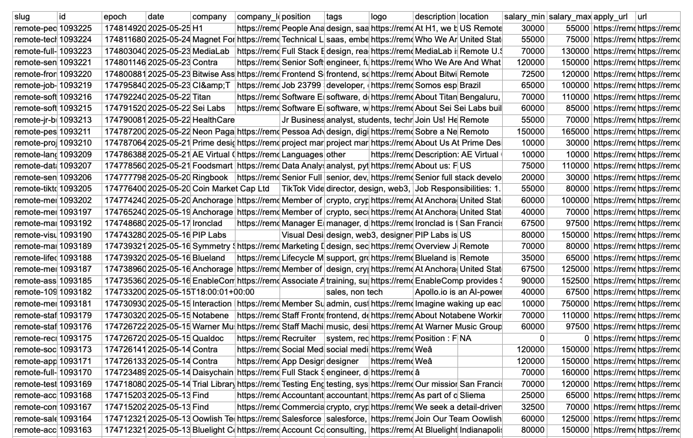
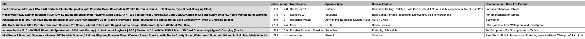

Web Scraping Project
This repository contains two Python scripts for web scraping:

api_scraper.py: Scrapes job postings from the RemoteOK API and saves them to an Excel file.
html_scraper.py: Scrapes product information from Amazon product pages and saves it to a CSV file.

Features
API Scraper (RemoteOK Job Postings)

Fetches job postings from RemoteOK.
Cleans and validates data, including HTML tag removal from descriptions and salary validation.
Outputs structured job data (e.g., company, position, salary, location) to an Excel file (remote_jobs.xls).
Handles errors gracefully with fallback values (e.g., "N/A" for missing fields).

### 📁 API Scraper Output (Excel File)

HTML Scraper (Amazon Product Data)

Scrapes product details (title, price, rating, technical details) from Amazon product pages.
Uses concurrent processing with multiple threads for faster scraping.
Reads product URLs from a CSV file (amazon_products_urls.csv) and outputs results to a timestamped CSV file (e.g., output-05-26-2025.csv).
Handles missing data and provides progress tracking with a progress bar.

### 📊 HTML Scraper Output (CSV File)

Python 3.8+
Required Python packages:
requests
xlwt
beautifulsoup4
tqdm

Install dependencies using:pip install requests xlwt beautifulsoup4 tqdm

Installation

Clone the repository:git clone https://github.com/your-username/web-scraping-project.git
cd web-scraping-project

Install the required packages:pip install -r requirements.txt

For the HTML scraper, prepare a CSV file named amazon_products_urls.csv with a single column of Amazon product URLs.

Usage
Running the API Scraper

Run the script:python api_scraper.py

The script will fetch job postings from RemoteOK and save them to api_scraper_output_xls/remote_jobs.xls.

Running the HTML Scraper

Ensure amazon_products_urls.csv exists in the project directory with valid Amazon product URLs.
Run the script:python html_scraper.py

The script will scrape product data and save it to a CSV file (e.g., output-05-26-2025.csv) in the project directory.

File Structure
Py_web_scraping_and_automation/
│
├── api_scraper.py  
│ ├── api_scraper_output_xls # Output directory for API scraper
│ │ └── remote_jobs.xls # Script to scrape RemoteOK job
│ └── remoteok_scraper.py # Script to scrape
├── html_scraper.py  
│ ├── amazon_products_urls.csv # Input file for HTML scraper (user-provided)
│ ├──amazon_scraper.py # Script to scrape Amazon product data
│ └── output-05-25-2025.csv #Output of amazon scraper  
├── requirements.txt # Python dependencies
├── README.md # This file
└── public/ # Directory for screenshots
├──screenshot1.png # Placeholder for output screenshot
└── screenshot1.png # Placeholder for output screenshot

Notes

API Scraper: The RemoteOK API may have rate limits or require authentication in the future. Check RemoteOK API documentation for updates.
HTML Scraper: Amazon’s website structure may change, requiring updates to the scraping logic. Ensure the input CSV contains valid product URLs.
Error Handling: Both scripts include robust error handling to manage missing data or network issues.
Concurrency: The HTML scraper uses multithreading (concurrent.futures) to process multiple URLs efficiently.

Contributing

Fork the repository.
Create a new branch (git checkout -b feature-branch).
Make changes and commit (git commit -m "Add feature").
Push to the branch (git push origin feature-branch).
Open a Pull Request.

License
This project is licensed under the MIT License.
